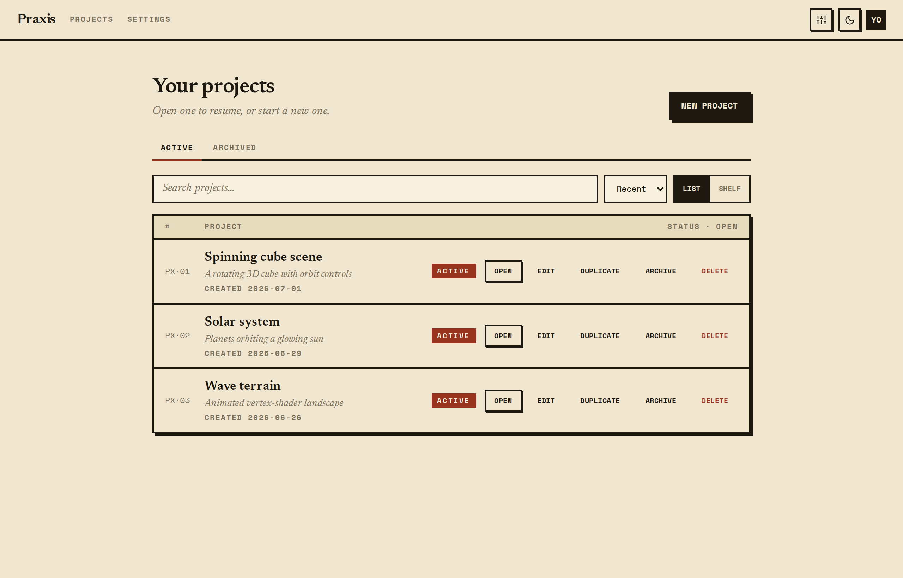

# Praxis (local, single-user)

Build web apps by chatting with an AI coding agent — on your own machine, with
your own API key. Pick a template, prompt the agent, and watch a live preview
update as it writes the code. Every change is committed to git so you can see
how the app was built.

This is a local, single-user fork of Praxis: no accounts, no teams, no cloud —
just you and the agent. It runs entirely on your machine via Docker.



Every project opens into a three-pane workspace: a file tree and Monaco editor on
the left, a live preview of the running app in the middle, and a chat panel on the
right that drives the agent. Prompt it, and it writes code, commits to git, and the
preview hot-reloads — no local toolchain to install, since each project runs in its
own Docker sandbox.

<!-- Add a workspace screenshot: capture with apps/web/scripts/capture-workspace.mjs,
     save to docs/images/workspace.png, then uncomment the line below.

-->

## How it works

- **apps/web** — Next.js UI: dashboard, and a workspace with a file tree, Monaco
  editor, live preview, git panel, and a chat panel that drives the agent.
- **services/orchestrator** — Bun + Hono. Owns the session lifecycle: starts a
  per-project Docker sandbox, runs the agent over the Agent Client Protocol (ACP),
  streams events to the browser, and reverse-proxies the sandbox's dev server as
  a live preview.
- **Sandboxes** — each project runs in its own Docker container (from
  `praxis-sandbox-base`) with a persistent `/workspace` volume, seeded from a
  template on first run. The agent (Claude Code, via the ACP adapter) runs inside
  it on your `ANTHROPIC_API_KEY`.

Two abstractions are kept deliberately swappable: the `Sandbox` interface
(`packages/sandbox`) and the `AcpHost` (`packages/acp-host`). See `ARCHITECTURE.md`.

## Requirements

- **[Docker](https://docs.docker.com/get-docker/)** — Desktop on macOS/Windows, or
  Engine on Linux. Must be running.
- **[git](https://git-scm.com/)** — to clone the repo.
- **Node 20+ and [pnpm](https://pnpm.io) 9** — used once, to create the database
  schema + seed. (Install pnpm with `npm install -g pnpm` or `corepack enable`.)
- An **[Anthropic API key](https://console.anthropic.com/)** — the agent runs on
  your own key.

## Quickstart

Run these from the repo root. The whole app runs in Docker; Node/pnpm are only
needed for the one-time schema + seed in step 4.

```bash
# 1. Clone the repo.
git clone https://github.com/g-chappell/praxis-public.git
cd praxis-public

# 2. Configure. Copy the template and set ANTHROPIC_API_KEY (the only required value).
cp .env.example .env
$EDITOR .env          # paste your key into ANTHROPIC_API_KEY=

# 3. Build the sandbox base image (once; takes a few minutes).
docker compose --profile build build sandbox-base

# 4. Create the database schema + seed the local user.
docker compose up -d db      # start Postgres
pnpm install                 # install workspace deps (for the db tooling)
pnpm db:push                 # create the tables
pnpm db:seed                 # seed the single local user

# 5. Build + start the app (Postgres + orchestrator + web).
docker compose up --build web orchestrator
```

`docker compose up --build web orchestrator` builds the web + orchestrator images
from the current source and brings up `db` too (it's a dependency). Logs print in
the foreground — add `-d` to run detached. The first build takes a couple of
minutes; wait for the `praxis-web` line to report it's ready.

> **`--build` matters.** Without it, `docker compose up` reuses whatever
> `praxis-web` / `praxis-orchestrator` image already exists and will serve **stale
> code** after you pull changes. Always start with `--build` (or run
> `docker compose build web orchestrator` first).

### Open the app

Go to **http://localhost:3000** — no login. Create a project, then prompt the
agent in the chat panel; it writes code, and the **Preview** tab shows the running
app (served at `http://<projectId>.preview.localhost:4001` — browsers resolve any
`*.localhost` name to your machine, so there's no DNS or hosts-file setup).

To stop everything: `docker compose down` (add `-v` to also wipe the database).

**Updating to a newer version:** `git pull`, then rebuild before starting —
`docker compose up --build web orchestrator`. If the schema changed, re-run
`pnpm db:push`; if the sandbox image changed, re-run step 3.

> **Prefer hot reload while hacking on Praxis itself?** After steps 1–4, run
> `pnpm dev` instead of step 5 to start web (:3000) + orchestrator (:4001) on the
> host with live reload. Docker is still used for the per-project sandboxes.

## Configuration

All configuration lives in `.env` (see `.env.example`):

| Variable | Purpose |
| --- | --- |
| `ANTHROPIC_API_KEY` | **Required.** Powers the coding agent. |
| `OPENAI_API_KEY` | Optional. Enables the image-generation MCP tool. |
| `DATABASE_URL` | Postgres connection string. |
| `ORCHESTRATOR_INTERNAL_SECRET` | Shared secret for web → orchestrator calls. |
| `PREVIEW_DOMAIN` / `PREVIEW_SCHEME` / `PREVIEW_PORT` | Live-preview URL shape. |

Your API keys are read from the environment and passed to the agent in memory —
they are never written to the database or logged.

## Development

```bash
pnpm dev            # web (:3000) + orchestrator (:4001) with hot reload
pnpm test           # unit tests (Vitest)
pnpm typecheck      # tsc --noEmit across workspaces
pnpm lint           # prettier --check && eslint
pnpm build          # production build
```

Docker-backed integration tests for `packages/sandbox` and `packages/acp-host`
are gated behind `RUN_DOCKER_TESTS=1`.

## License

MIT — see `LICENSE`.
